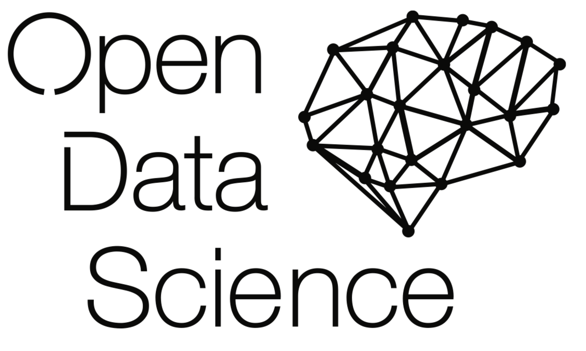

# Deep Learning Course by ODS

## Part 1: Autograd
- Pavel Nesterov
- http://pavelnesterov.info
- http://linkedin.com/in/nesterovpavel

### Content
- Machine Learning reminder
- Logistic Regression using SGD
- Autograd, single variable
- Autograd, multivariable
- Logistic Regression using Autograd

### Structure
- [Full version of lecture with solutions of tasks](./lecture-1/lecture_full/dlcc_part1.ipynb)
- [Version of lecture without solutions of tasks](./lecture-1/lecture_no_solutions/Lecture_template_form.ipynb	)
- [Folder with four programming assignments without solution](./lecture-1/tasks/)

## Part 2: PyTorch

## Part 3: Real-life deep learning
